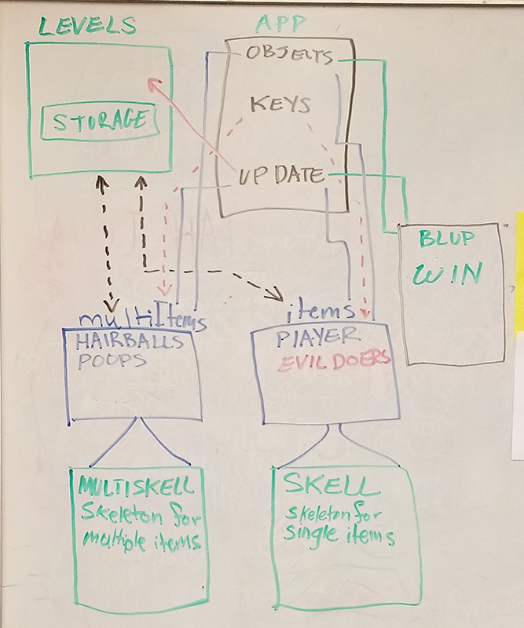

## Cat Game

#### ¤ [Timeline](http://intmain.in/timelineCat/) ¤

##### 05/14/18

Below is a photo I took of my game as is and what it needs to be. I need to do another refactor in order to get levels to be a seperate thing.

This photo is an idea for what my refactor will be like

 

##### 05/13/18

I need to create another file to host classes for levels. I think that would be an easy way to load and change what each level looks like.

##### 04/22/18

I finally sat down and fixed the cat poops. I realized that I was updating all instances of all poops. I had to then not use the skeleton gravity and use the poop class gravity overide to get them to behave. I have still an error with poop timing. They tend to come out faster and faster and then have a reset. So I need to see how I am programming the poops and fix them.

##### 04/12/18

Over the break I refactored my cat game. Originally when I first programmed the cat game it was all in one file with many functions. This became efficient because, although you could make that work, there is no organization and when you want to make each character do something in the game, there has to be soo many new functions made. Not to mention the headache of many functions splaid about. I then refactored my cat game to have classes with functions. This was working out really well. I could use one class for many instances of a character (like the poops). But this too was all on one file, I also craved more organization, something wasn't right. I decided to refactor again (during spring break) I broke up the game into different python files and decided to learn how to create different class hierarchies. There are 4 files. The main file that runs the game and has the while loop to keep the game refreshing it's graphics. The second page is a small one to handle only the graphics setup. Then there are 2 more files. One is called skell for skeleton. This is the master class that holds all the generic classes that all other class will use. The last file is all classes. I could break this up in the future as well. Having classes that use skell makes my life a LOT easier. most of the functions I need are in the skeleton, but if a class needs a modified version I can still build it and I can also use the original master class. Because I had to refactor the cat game and deal with passing arguments between classes I am rebuilding the actions I had set up earlier. Below is a list of what I have done and what I need to do to catch up.

* Get the cat poops to obey collision and not speed up as the cat keeps pooping.
* Get the cat to throwup
* Add a bad collision (ie lava)
* ~~Get the cat to move forward and back~~
* ~~Get the cat to jump~~
* ~~Scroll Clouds~~
* ~~Scroll Trees~~

##### 03/11/18

I added 9 lives to the cat (nine hearts) and add an 'enemy' which is a collidable surface that looks like lava. It affects the cats health. Here is an updated video 

[https://youtu.be/3xZkFHpoB_8](https://youtu.be/3xZkFHpoB_8)

##### 03/09/18

I got smooth jumping to work! I introduced velocity! Below will be a video of it. I also got projectile hairballs to work too! I started creating platforms that harm my cat and tied that into a health bar above. But I still want to refactor to create classes in seperate files for clarity sake. This is a new leap for me! It may take me awhile but I will get it.

[https://youtu.be/YxQnRSdscAQ](https://youtu.be/YxQnRSdscAQ)

##### 03/04/18 2.49 AM

I am having trouble with getting my cat to jump smoothly. So I deleted everything to do with jump and will attempt it later. I got my trees and clouds to scroll by. 

As for the cat jumping. I have to recognize the key hit for jump (done) I then have to allow for the animetion of the cat to jump up. During this time I cannot let gravity affect the cat. Then the cat needs to allow gravity to bring it down. I need to make sure that the up button doesn't affect the cat through all of this... I am having a lot of trouble trying to figure out the logic to this.

##### 03/03/18

I have been very religiously working on a python game. It has taught me a LOT already

* I have learned more about programming organization
* I have learned how to use classes
* I am learning about timing issues with games.
* I have succesfully been able to clear each goal I set for my self within a reasonable time frame.

Here is a screen shot of my game.

My github for this project is located at [https://github.com/ironsketch/catPoop](https://github.com/ironsketch/catPoop)

