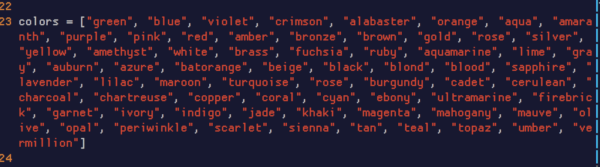
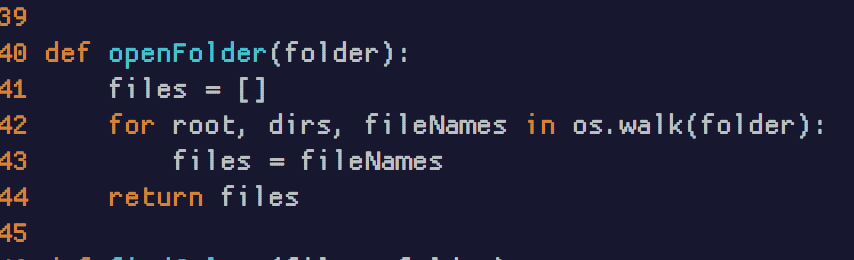
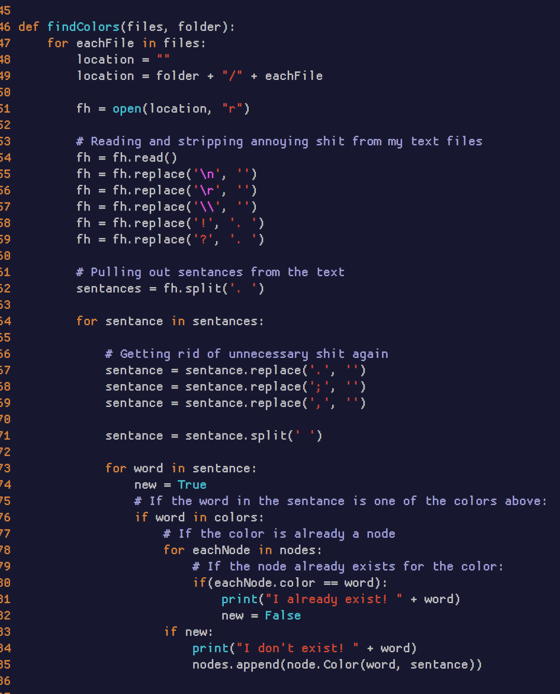
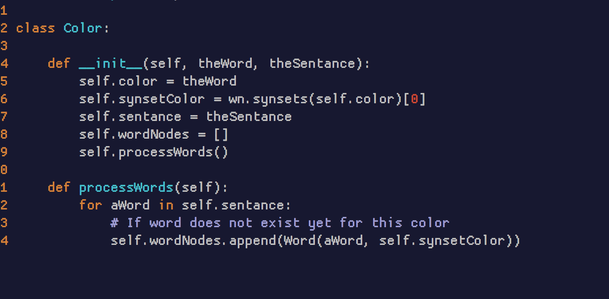
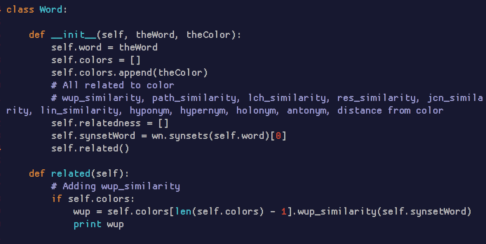

## SOS Project Neural Networks

#### ¤ [Proposal](http://intmain.in/proposal/) ¤ [Timeline](http://intmain.in/timeline/) ¤ [Bibliography](http://intmain.in/bibliography/) ¤

[Definitions](#definitions)

##### 05/02/18

Here is a rundown of my refactoring.

Above is my list of color words that I am focusing on.

Above is my simple code to walk a folder and pull out the name of all files in this folder. This folder holds all the text files of books.

Above is my code to cut out all unessecary !, ?, ;,, , etc. First I pull out new lines and change all ? and ! to . and after I split out each sentance I then replace any other word seperaters with no space. I then split each sentace by spaces.

After that (for now) I print if I found a color and if it was already found I remark that I found it again. This is working exceptionally well.

For now, I have a node being made for each new color. In the future I will add code to modify the original node with the data from the color that was found after the first time.

From above you can see the class for creating a new color. For each color created, so far I have set up an array for each word that is associated with the color. Each word is then processed in comparison to the color.

Above you can see that each word is then going to compare many different aspects that wordnet provides. I will in the future add a description of what each means. Each addition will be a number from 0 - 1. If none is created (which sometimes there is no corrolation then a 0 will be placed instead)

##### 04/30/18

I refactored my program. I set up a much clearer base program without logical redundancies. My next step now is to think about what I want to pull out and how I will pull that out. For example. If a word is a hypernym of another? Do I want to find that and how would I do that.

I was able to import WordNet into python via NLTK python package. I am now learning what this is and how I may be able to use it for my program.

##### 04/29/18

I started to read Measuring Simularity Between Sentances. Most noteable is it's discussion on relatedness. How words can be [hypernyms](#hypernym), [hyponyms](#hyponym), [troponyms](#troponym) etc. of eachother. It also discusses the [holonymy](#holonymy) and [meronymy](#meronymy) of words. How you can use these relations to to develope the actual meaning of what is being said. I can use some of this when I build my python code. I am not sure how yet though. But an example would be pine cone. What does pine and cone have in common? Pine could be an evergreen tree or to long for someone. Cone could mean a shape or the fruit of an evergreen tree.  

One thing I can do though is make a tree of related words to each color and also create a matrix of all of these hypo,holo,mero meanings etc. In otherwords I think I found a way to create a matrix that could be fed into a nueral network. Depending on the relatedness of the color I could set a flag for it... Not 100% sure how to do this or exactly how I will organize the data. But I feel closer.

##### 04/22/18

I feel at a loss, helpless at my learning ability. But instead of give up, I started to just program anything, anything at all. I started to use python and started with parsing through many free text books in .txt format for colors. I take each sentance that has a color in it and find it's location in the sentance and then find each words absolute value from that color. 

* Next I need to double check my math. I believe some of it is off already, I'm getting positions like 54 or so. 
* Then I need to disallow words that are farther than 5 away from the color. Planned reading [Lexical Co-occurrence, Statistical Significance, and Word Association](http://www.aclweb.org/anthology/D11-1098)
* Then I need to weed out words that are 2 or smaller letters and specific 3 letter words. For example, the, for, and, etc.
* I need to implement a weighted average to find the average placement of color words and other words in relation to it's color.

After all of this is done I will look at how my data is demonstrating corrolation and see how I can implement this into a neural network. I believe a lot of my confusion also comes from not having a good understanding of how neural networks work.

##### 03/03/18

I am having trouble following my dreams! I want to get into neural networks but I feel as if I am flailing around. I got a book suggested by my teacher, it is on it's way. Object-oriented neural networks in C++ by Joey Rogers. I am going to try again when I get this book.

##### 02/20/18

This walk through talks about having something that can process Matrix Algebra. Which sounds like to me like arrays and math. But I installed Armadillo just in case. And it is nice to be able to plot graphs (also recommended by the tutorial). In the future I would like to cat the info to a file and modify that in [https://processing.org/](https://processing.org/) but for now I will install PlotUtils. [https://www.gnu.org/software/plotutils/](https://www.gnu.org/software/plotutils/) 

The teacher talked about learning how to make a basic Nueral Network in C++ since the school has had students do that in the past. That seems like fun and gives me a direct direction. I found a good blog to read which I will start today. [http://code-spot.co.za/2009/10/08/15-steps-to-implemented-a-neural-net/](http://code-spot.co.za/2009/10/08/15-steps-to-implemented-a-neural-net/)

##### 02/06/18

I talked to the teacher about an idea I had to use the data structures we are using to make a simple silly relational network (would not call it a [neural network](#Neural_Network)) But each word would have a % of use. Each color would have a percentage of use and compare... ? We will see. [Here](images/weirdidea-1.png) is an image of my abstract idea.

I started reading a book I got at a used bookstore. 'Mapping the Mind' by Rita Carter. It seemed interesting and it has important information on how neurons work. Which I have studied breifly in the past so it is good to relearn. Unfortunately this book talks about [Phrenology](#phrenology) as if it's legitimate. :( I fear for the world. [Phrenology History of a Pseudoscience](https://theness.com/index.php/phrenology-history-of-a-pseudoscience/)

##### 02/05/18

Focused on MidTerms, little time to read. I added my first book/resource used to my Bibliography. I was given new books to help out with this project.They are, Languages and Machines, Neural Networks for Pattern Recognition, and Foundations of Genetic Programming!

##### 01/30/18

Today I set up my website again. I felt bad that it was not ready for class. I want to add a soft image to the background. I am pleased with the colors. I need to work on my bibliography. My goal is to have it be an official bibliography. But right now it's copy n paste. I would also like to see if I can't hone my timeline.. But that is less important to me as since this is such a huge project. I mostly want to go through the Deep Learning book since it will also force me to learn linear algebra amongst (I'm sure) many other things!

##### 01/27/18

I started to go through the Deep Learning book. I am running through the introduction (worth it!). I was intrigued when it gave a real example of how [AI](#ai) fails. "It's inference engine detected an inconsistency in the story: it knew that people do not have electrical parts, but because Fred was holding an electric razor, it believed the entity "FredWhileShaving" contained electrical parts. It therefore asked whether Fred was still a person while he was shaving."

##### definitions #####

###### Hypernym ######

A word with a broad meaning that more specific words fall under; a super ordinant. Ex color is a hypernym of red.

###### Hyponym ######

Opposite of Hypernym. Ex. Red is a hyponym of color.

###### Troponym ######

A verb that indicates more precisely the manner of doing something by replacing a verb of a more generalized meaning ex. Stroll is a troponym of walk.

###### Holonymy ######

Greek holo, whole and nymy, name - defines the relationshop between a term denoting the whole and a term denoting a part of, or a member of, the whole

###### Meronymy ######

Similar to Holonymy but not in regards to the whole just a part of.

###### Stochastic ######

Randomly determined; having a random probability distribution or pattern that may be analyzed statistically but may not be predicted precisely.

###### Accidence ######

The part of grammar that deals with the inflection of words

###### Inflexional ######

In grammar, inflection or inflexion - sometimes called accidence - is the madofication of a word to express different grammatical ctegories such as tense, case, voice, aspect, person, number, gender, and mood,... The use of this suffix is inflection

###### Polysemous ######

Having multiple meanings

###### Heuristic ######

Enabling a person to discover or learn something for themselves

###### Neural_Network ######

Neural Network : a computer system modeled on the human brain and nervous system.

###### AI ###### 

Aritificial Intelligence : a branch of computer science dealing with the simulation of intelligent behavior in computers. 2 : the capability of a machine to imitate intelligent human behavior.

###### Phrenology ######

Phrenology : the detailed study of the shape and size of the cranium as a supposed indication of character and mental abilities.
