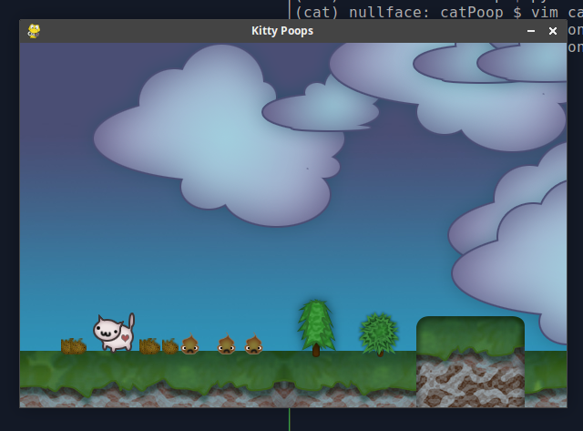
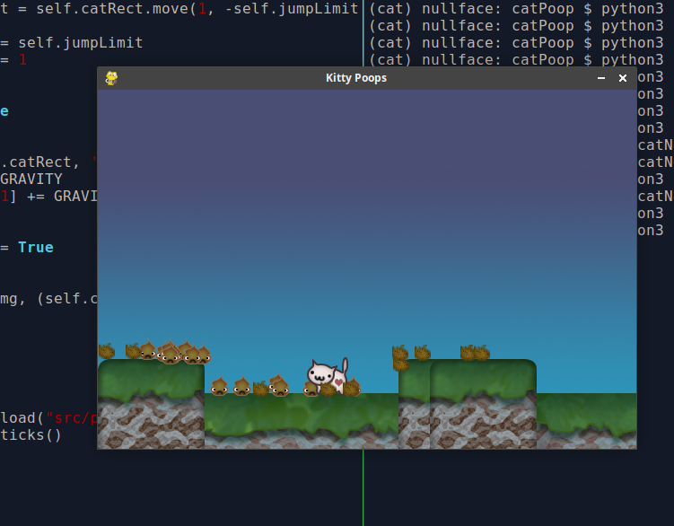

# SOS Project Neural Networks

### [Proposal](http://intmain.in/proposal/) [Timeline](http://intmain.in/timeline/) [Bibliography](http://intmain.in/bibliography/)

[Definitions](#definitions)

##### 03/11/18

I added 9 lives to the cat (nine hearts) and add an 'enemy' which is a collidable surface that looks like lava. It affects the cats health. Here is an updated video: [https://youtu.be/3xZkFHpoB_8](https://youtu.be/3xZkFHpoB_8)

##### 03/09/18

I got smooth jumping to work! I introduced velocity! Below will be a video of it. I also got projectile hairballs to work too! I started creating platforms that harm my cat and tied that into a health bar above. But I still want to refactor to create classes in seperate files for clarity sake. This is a new leap for me! It may take me awhile but I will get it.

[https://youtu.be/YxQnRSdscAQ](https://youtu.be/YxQnRSdscAQ)

##### 03/04/18 2:49 AM

I am having trouble with getting my cat to jump smoothly. So I deleted everything to do with jump and will attempt it later. I got my trees and clouds to scroll by. 

As for the cat jumping. I have to recognize the key hit for jump (done) I then have to allow for the animetion of the cat to jump up. During this time I cannot let gravity affect the cat. Then the cat needs to allow gravity to bring it down. I need to make sure that the up button doesn't affect the cat through all of this... I am having a lot of trouble trying to figure out the logic to this.

##### 03/03/18

I am having trouble following my dreams! I want to get into neural networks but I feel as if I am flailing around. I got a book suggested by my teacher, it is on it's way. Object-oriented neural networks in C++ by Joey Rogers. I am going to try again when I get this book. But if all else fails I have been very religiously working on a python game. It has taught me a LOT already:

* I have learned more about programming organization
* I have learned how to use classes
* I am learning about timing issues with games.
* I have succesfully been able to clear each goal I set for my self within a reasonable time frame.

Here is a screen shot of my game.

My github for this project is located at: [https://github.com/ironsketch/catPoop](https://github.com/ironsketch/catPoop)

##### 02/20/18

This walk through talks about having something that can process Matrix Algebra. Which sounds like to me like arrays and math. But I installed Armadillo just in case. And it is nice to be able to plot graphs (also recommended by the tutorial). In the future I would like to cat the info to a file and modify that in [https://processing.org/](https://processing.org/) but for now I will install PlotUtils. [https://www.gnu.org/software/plotutils/](https://www.gnu.org/software/plotutils/) 

The teacher talked about learning how to make a basic Nueral Network in C++ since the school has had students do that in the past. That seems like fun and gives me a direct direction. I found a good blog to read which I will start today. [http://code-spot.co.za/2009/10/08/15-steps-to-implemented-a-neural-net/](http://code-spot.co.za/2009/10/08/15-steps-to-implemented-a-neural-net/)

##### 02/19/18

I started 'trying' to teach myself Linear Algebra. I am using the book required by UW. Linear Algebra with Applications.

##### 02/17/18

Been sick but back on track. I started to use Kahn academy to learn Linear Algebra. Having an understanding of Linear Algebra is needed for Deep Learning.

##### 02/06/18

I talked to the teacher about an idea I had to use the data structures we are using to make a simple silly relational network (would not call it a [neural network](#Neural_Network)) But each word would have a % of use. Each color would have a percentage of use and compare... ? We will see. [Here](images/weirdidea-1.png) is an image of my abstract idea.

I started reading a book I got at a used bookstore. 'Mapping the Mind' by Rita Carter. It seemed interesting and it has important information on how neurons work. Which I have studied breifly in the past so it is good to relearn. Unfortunately this book talks about [Phrenology](#phrenology) as if it's legitimate. :( I fear for the world. [Phrenology History of a Pseudoscience](https://theness.com/index.php/phrenology-history-of-a-pseudoscience/)

##### 02/05/18

Focused on MidTerms, little time to read. I added my first book/resource used to my Bibliography. I was given new books to help out with this project.They are, Languages and Machines, Neural Networks for Pattern Recognition, and Foundations of Genetic Programming!

##### 01/30/18

Today I set up my website again. I felt bad that it was not ready for class. I want to add a soft image to the background. I am pleased with the colors. I need to work on my bibliography. My goal is to have it be an official bibliography. But right now it's copy n paste. I would also like to see if I can't hone my timeline.. But that is less important to me as since this is such a huge project. I mostly want to go through the Deep Learning book since it will also force me to learn linear algebra amongst (I'm sure) many other things!

##### 01/27/18

I started to go through the Deep Learning book. I am running through the introduction (worth it!). I was intrigued when it gave a real example of how [AI](#ai) fails. "It's inference engine detected an inconsistency in the story: it knew that people do not have electrical parts, but because Fred was holding an electric razor, it believed the entity "FredWhileShaving" contained electrical parts. It therefore asked whether Fred was still a person while he was shaving."

##### definitions #####

###### Neural_Network ######

Neural Network : a computer system modeled on the human brain and nervous system.

###### AI ###### 

Aritificial Intelligence : a branch of computer science dealing with the simulation of intelligent behavior in computers. 2 : the capability of a machine to imitate intelligent human behavior.

###### Phrenology ######

Phrenology : the detailed study of the shape and size of the cranium as a supposed indication of character and mental abilities.
